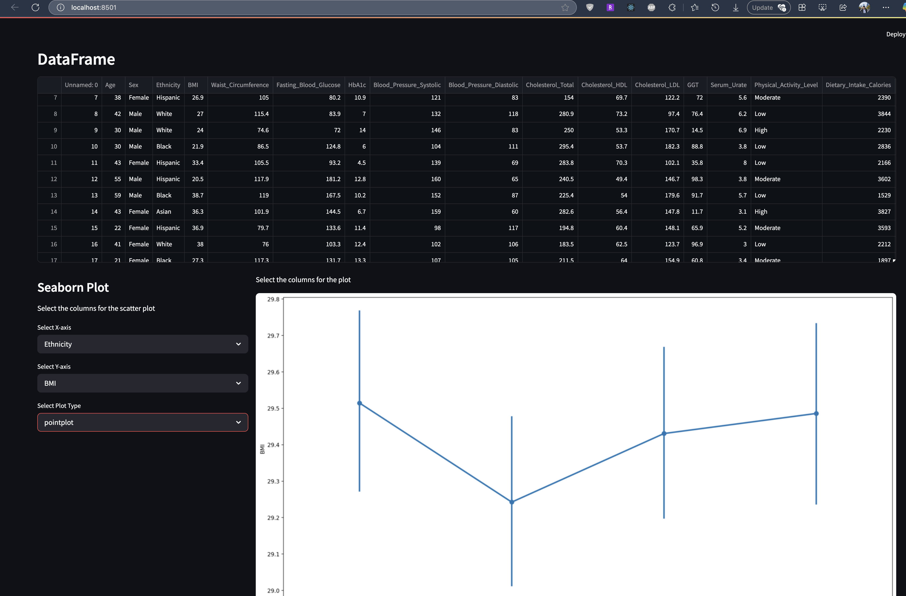
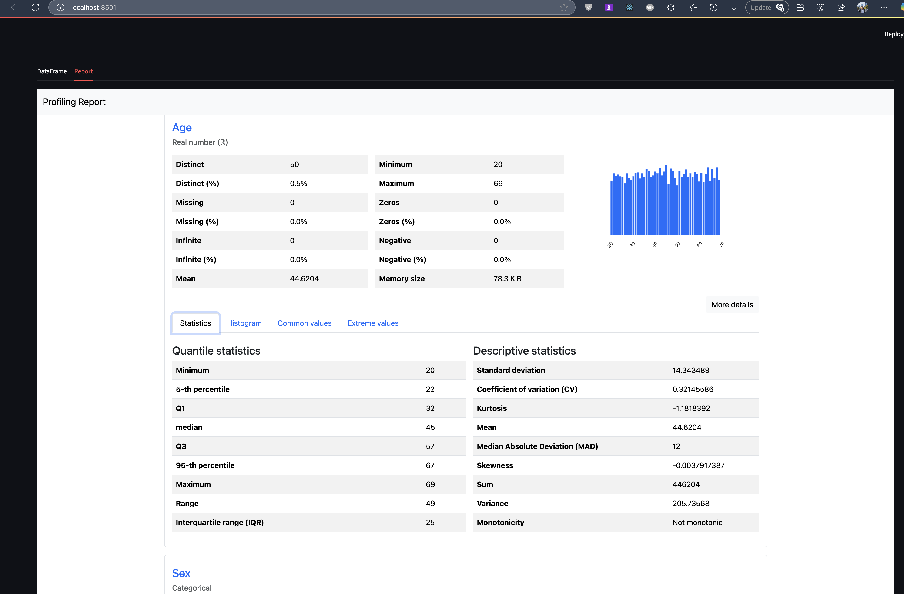

# ProfileReport

ProfileReport is a data analytics tool built using **Streamlit** that allows users to generate detailed profiling reports for their datasets. It supports `.csv` and `.xlsx` file formats and provides an interactive interface for exploring data insights.


---

## Features

- **File Upload**: Upload `.csv` or `.xlsx` files up to 10 MB.
- **DataFrame Display**: View the uploaded dataset in a tabular format.
- **Profiling Report**: Generate an interactive profiling report using the `ydata-profiling` library.
- **Minimal Report Option**: Choose between a full or minimal profiling report.
- **Excel Sheet Selection**: For `.xlsx` files, select the desired sheet to analyze.
- **Custom HTML Rendering**: Removes unnecessary navigation elements from the profiling report for a cleaner display.
- **Dynamic Seaborn Plots**: Generate dynamic visualizations such as scatter plots, heatmaps, and pair plots based on user-selected columns. This feature allows users to explore relationships between variables and uncover patterns in their data interactively.

---

## Benefits for Data Analytics

ProfileReport provides a comprehensive solution for data analytics by combining automated profiling with dynamic visualizations. Key benefits include:

1. **Quick Insights**: Automatically generate detailed profiling reports to understand the structure, distribution, and quality of your data.
2. **Interactive Visualizations**: Dynamically create Seaborn plots (e.g., scatter plots, heatmaps) by selecting columns, enabling users to explore relationships and trends in their data.
3. **Customizable Reports**: Choose between full or minimal profiling reports to focus on the most relevant insights.
4. **Improved Decision-Making**: By visualizing data patterns and correlations, users can make informed decisions and identify actionable insights.
5. **Ease of Use**: The app provides an intuitive interface for uploading files, selecting options, and generating reports, making it accessible to users with varying levels of technical expertise.

---

## Libraries Used

- **Streamlit**: For building the web application interface.
- **Pandas**: For data manipulation and analysis.
- **ydata-profiling**: For generating detailed profiling reports.
- **BeautifulSoup**: For modifying the HTML content of the profiling report.
- **Seaborn**: For creating dynamic and interactive visualizations.
- **Streamlit Components**: For embedding custom HTML content in the app.

---

## Installation and Setup

### 1. Create a Python Virtual Environment
```bash
python -m venv .venv
source .venv/bin/activate
```

### 2. Install Dependencies
```bash
pip install -r requirements.txt
```

### 3. Run the Application
```bash
streamlit run app.py
```

---

## How to Use

1. **Upload a File**: Use the sidebar to upload a `.csv` or `.xlsx` file.
2. **Select Options**: Choose the minimal report option if desired.
3. **View Data**: Explore the uploaded dataset in the "DataFrame" tab.
4. **Generate Report**: View the profiling report in the "Report" tab.
5. **Create Visualizations**: Use the dynamic Seaborn plot feature to select columns and generate visualizations such as scatter plots, heatmaps, and pair plots.

---

## Testing

- Upload a `.csv` file to generate a profiling report.
- For `.xlsx` files, select the desired sheet from the sidebar.
- Use the dynamic plot feature to create visualizations based on selected columns.

---

## Notes

- The maximum allowed file size is **10 MB**.
- Only `.csv` and `.xlsx` file formats are supported.
- The profiling report is displayed directly in the app, with unnecessary navigation elements removed for better usability.
- Dynamic Seaborn plots provide an interactive way to explore data relationships and trends.


## Screenshot


---

---



